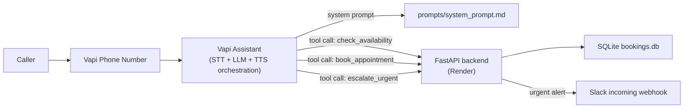

# Summit Air AI Phone Agent

An AI phone agent for Summit Air (a regional HVAC company) that answers
inbound calls, figures out the issue, determines residential vs. commercial,
flags true emergencies (gas smell, no heat in winter with a vulnerable
occupant, no AC with a medical condition) to human dispatch in real time, and
books a service appointment.

**Live number:** +1 (943) 223-9389

## Architecture



- **[Vapi](https://vapi.ai)** owns the actual voice pipeline: telephony,
  speech-to-text, the LLM turn loop, text-to-speech, barge-in/interruption
  handling. This is the highest-leverage place to *not* build custom
  infrastructure — it's a solved problem, and burning the time budget on a
  hand-rolled Twilio Media Streams pipeline would trade "does it work
  reliably" for "impressive-looking custom code."
- **[prompts/system_prompt.md](prompts/system_prompt.md)** is the actual
  brain of the agent - identity, conversation flow, urgency rules, and
  guidance for going off-script. This is the file to read/edit first.
- **The backend** ([backend/app](backend/app)) is a small FastAPI app that
  implements the three tools the assistant can call, persists bookings to
  SQLite, and posts urgent alerts to Slack.
- **[vapi/deploy.py](vapi/deploy.py)** is the one script that pushes the
  tools + prompt + assistant config + phone number to Vapi. It's idempotent
  - re-run it any time the prompt or tools change.

## Repo layout

```
prompts/system_prompt.md    The system prompt + first message (source of truth)
backend/app/main.py         FastAPI routes for the 3 tools + admin/debug views
backend/app/storage.py      SQLite persistence (bookings, escalations, debug log)
backend/app/availability.py Mocked appointment-slot generator
backend/app/slack.py        Slack incoming-webhook notifier
backend/app/security.py     Tool webhook auth (x-vapi-secret / x-vapi-signature)
backend/.python-version     Pins Python 3.12 on Render
vapi/deploy.py              Idempotent script: tools + assistant + phone number
vapi/tool_definitions.py    JSON-schema definitions for the 3 tools
vapi/fetch_calls.py         Pulls recent call transcripts from Vapi for review
render.yaml                 Render Blueprint for one-click backend hosting
```

## One-time setup

### 1. Vapi account

1. Sign up at [vapi.ai](https://dashboard.vapi.ai) (free trial credit is
   plenty for building/testing).
2. Dashboard -> **Settings -> API Keys** -> copy the **Private key** (not the
   public key - the public key is only for client-side/browser widgets; every
   call `vapi/deploy.py` makes is server-to-server). This is `VAPI_API_KEY`.

### 2. Slack alert channel

1. Go to [api.slack.com/apps](https://api.slack.com/apps) -> **Create New
   App** -> From scratch. Any workspace works, even a personal one.
2. **Incoming Webhooks** -> toggle on -> **Add New Webhook to Workspace** ->
   pick a channel.
3. Copy the webhook URL. This is `SLACK_WEBHOOK_URL`.

### 3. Deploy the backend (Render, free, no credit card)

Easiest path - Render Blueprint:

1. Push this repo to GitHub.
2. In the [Render Dashboard](https://dashboard.render.com), **New -> Blueprint**,
   point it at the repo. It will read [render.yaml](render.yaml) and create
   the web service automatically.
3. When prompted, fill in `VAPI_TOOL_SECRET` (any random string, e.g. output
   of `openssl rand -hex 32`), `SLACK_WEBHOOK_URL`, and optionally
   `ADMIN_TOKEN`.
4. Once deployed, note the public URL (e.g.
   `https://summit-air-backend.onrender.com`). This is `BACKEND_BASE_URL`.

Manual alternative (no Blueprint): New -> Web Service -> connect the repo ->
root directory `backend` -> build command `pip install -r requirements.txt`
-> start command `uvicorn app.main:app --host 0.0.0.0 --port $PORT` -> Free
instance -> add the same env vars manually.

Notes from actually deploying this:

- **Pin the Python version.** Render defaults new services to the latest
  Python (3.14 as of this writing), which doesn't have prebuilt wheels for
  `pydantic-core` yet and fails trying to compile it from source (no Rust
  toolchain / read-only filesystem on Render's build image). `render.yaml`
  pins `PYTHON_VERSION=3.12.7` and there's a `backend/.python-version` as a
  backup - if you deploy manually without the Blueprint, set
  `PYTHON_VERSION` yourself.
- **Render's free tier spins down after 15 minutes idle** and takes 30-60s to
  wake back up on the next request. For a phone call that means the *first*
  tool call after idle time could have an awkward pause. If that shows up
  during testing: upgrade the Render service to the $7/mo Starter plan (no
  spin-down), or set up a free external cron (e.g.
  [cron-job.org](https://cron-job.org)) to hit `/health` every 10 minutes.

### 4. Deploy the Vapi assistant

```bash
cd summit-air-phone-agent
python3 -m venv .venv && source .venv/bin/activate
pip install -r vapi/requirements.txt

export VAPI_API_KEY=...
export VAPI_TOOL_SECRET=...        # must match what you set on Render, exactly
export BACKEND_BASE_URL=https://summit-air-backend.onrender.com
export VAPI_AREA_CODE=555          # optional - see note below

python vapi/deploy.py
```

This creates (or updates) the 3 tools, the assistant, and a phone number, and
prints the live phone number at the end. Re-run it any time you edit
`prompts/system_prompt.md` or the tool schemas - it matches existing
resources by name and updates them rather than duplicating.

Notes from actually deploying this:

- **Vapi's free phone numbers only support a rotating subset of area codes.**
  Requesting an unavailable one returns a 400 with a hint of currently-valid
  codes; `deploy.py` automatically retries with the first suggested code, so
  you don't need to get this right up front (the actual digits are somewhat
  arbitrary anyway - Summit Air's real area code(s) would depend on which of
  the three counties you want the number to look local to).
- **`voice` and `transcriber` are set explicitly** rather than left to
  default - an assistant created via the API doesn't reliably inherit the
  dashboard's "Balanced preset" the way dashboard-created assistants do. Uses
  Vapi's own `voice: {provider: "vapi", voiceId: "Elliot"}` and
  `transcriber: {provider: "deepgram", model: "flux-general-en"}`, both
  billed through Vapi directly so no separate 11labs/Deepgram account is
  needed.
- **Tool webhook auth uses the plain `x-vapi-secret` header**, not an
  HMAC-signed `x-vapi-signature` - despite some Vapi docs suggesting HMAC is
  the current default, live testing showed the inline `tool.server.secret`
  field is delivered as a raw shared secret. `backend/app/security.py`
  accepts either, so this is handled either way.

### 5. Test

- Fastest iteration loop: Vapi Dashboard -> Assistants -> Summit Air
  Dispatcher -> **Talk to Assistant** (browser mic, no phone number needed).
- Then call the real number and try to break it - wrong info, interruptions,
  going off-topic, the emergency triggers, etc.
- Check `https://<your-backend>/bookings?token=<ADMIN_TOKEN>` to see
  everything that got booked or escalated. **Set `ADMIN_TOKEN` on Render** -
  without it, this page (and `/debug/raw-tool-requests`) are open to anyone
  with the URL and contain real caller names/phone numbers/addresses.
- `python vapi/fetch_calls.py --full --limit 5` pulls recent call
  transcripts straight from Vapi's API - the fastest way to review call
  quality without leaving the terminal.
- `GET /debug/raw-tool-requests?token=<ADMIN_TOKEN>` is a **temporary**
  diagnostic endpoint added while debugging the live integration (see below).
  It logs the last 50 raw tool-call payloads, headers, and any unhandled
  exceptions. Safe to leave in for the review call, but should be removed (or
  at minimum kept behind `ADMIN_TOKEN`) before any real production use.

## Debugging journal (what actually broke during setup)

Kept here deliberately - this is as much a demonstration of judgment and
debugging process as the code itself:

1. **Render build failed on `pydantic-core`.** Render defaulted to Python
   3.14, which doesn't have prebuilt wheels for that version of
   `pydantic-core` and tried (and failed) to compile it from source. Fixed by
   pinning `PYTHON_VERSION=3.12.7`.
2. **Tool secret mismatch.** After deploying, the tool webhooks returned
   "invalid signature" - I'd generated `VAPI_TOOL_SECRET` locally but the
   value typed into Render's Blueprint form didn't match. Straightforward
   fix, but a good reminder that a shared secret needs to be copied exactly,
   not regenerated on each side.
3. **Free phone number provisioning needs an area code**, and only a
   rotating subset are available at any given time - the first request
   failed with a 400 telling us which codes currently work. Made
   `deploy.py` auto-retry with the suggested code instead of requiring a
   human to read the error and re-run manually.
4. **`voice`/`transcriber` were silently unset** on the API-created
   assistant even though dashboard-created assistants get sensible defaults
   automatically. Would have risked the call not working at all, or working
   with default settings nobody chose - set both explicitly instead of
   trusting an assumption from the dashboard-focused quickstart docs.
5. **Live calls failed mid-conversation ("having trouble processing this
   right now")** even though everything looked right in isolated `curl`
   tests. Added temporary raw-request logging
   (`storage.log_raw_tool_request`, `/debug/raw-tool-requests`) rather than
   guessing, which turned up two real issues at once:
   - The model was writing the literal string `"caller ID number"` as the
     `phone` argument instead of an actual number - the prompt referenced
     "caller ID" conceptually but never gave the model the real digits.
     Fixed by injecting Vapi's `{{customer.number}}` Liquid variable
     directly into the system prompt.
   - Every tool call was failing signature verification. Vapi's own docs
     describe the inline `tool.server.secret` field as producing an
     HMAC-signed `x-vapi-signature` header, but the actual header sent was a
     plain `x-vapi-secret` matching the raw secret. Made the backend accept
     either, and confirmed via the debug log which one was actually in play.

After all five fixes, a full test call (no heat + elderly occupant in the
home) went end-to-end correctly on the first try: urgency correctly
classified as emergency, dispatch alerted via Slack mid-call before booking
was even complete, real caller ID used and confirmed aloud, availability
offered with the emergency slot first, appointment booked, confirmation
number read back, and the booking record in `/bookings` matched the
conversation exactly.

## What was built vs. intentionally skipped

Given the time box, judgment calls on what mattered most:

**Built:**
- A real, callable phone number with a full conversational flow, confirmed
  working end-to-end on live test calls (see debugging journal below).
- Explicit, testable urgency rules for the three named emergency triggers,
  with immediate Slack escalation that can fire mid-call, before booking is
  complete.
- Real booking persistence (SQLite) with a confirmation number read back to
  the caller, and the real caller-ID number wired in via Vapi's
  `{{customer.number}}` variable rather than left for the model to guess.
- Fairly extensive prompt guidance for going off-script (pricing questions,
  asking for a human, frustrated callers, multiple issues, calling on behalf
  of someone else, bad audio, etc.) since that's explicitly called out as an
  evaluation criterion.

**Skipped (and why):**
- **Real calendar/CRM integration** (ServiceTitan, Housecall Pro, etc.) -
  replaced with a mocked slot generator ([backend/app/availability.py](backend/app/availability.py)).
  Wiring a real dispatch system is an integration problem specific to
  whatever Summit Air actually runs, not something to guess at in a take-home.
- **Live transfer to a human** - no human line to transfer to in this
  context. The agent is instructed to be honest about this rather than fake
  a transfer, and offers a callback instead.
- **SMS/email confirmations, multi-language support, payment collection** -
  not mentioned as requirements, cut to stay focused on the core flow.
- **Concurrency-safe storage** - SQLite is fine for a single-line demo, not
  for production call volume.

## Iterating on the prompt

Everything about *how* the agent behaves lives in
[prompts/system_prompt.md](prompts/system_prompt.md). Edit it, then re-run
`python vapi/deploy.py` to push the change - no need to touch the Vapi
dashboard directly (and please don't hand-edit the prompt there, or this file
will drift out of sync with what's actually live).
