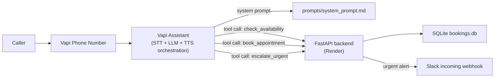

# Summit Air AI Phone Agent

An AI phone agent for Summit Air (a regional HVAC company) that answers
inbound calls, figures out the issue, determines residential vs. commercial,
flags true emergencies (gas smell, no heat in winter with a vulnerable
occupant, no AC with a medical condition) to human dispatch in real time, and
books a service appointment.

**Live number:** _fill in after deployment (see below)_

## Architecture



- **[Vapi](https://vapi.ai)** owns the actual voice pipeline: telephony,
  speech-to-text, the LLM turn loop, text-to-speech, barge-in/interruption
  handling. This is the highest-leverage place to *not* build custom
  infrastructure — it's a solved problem, and burning the time budget on a
  hand-rolled Twilio Media Streams pipeline would trade "does it work
  reliably" for "impressive-looking custom code."
- **[prompts/system_prompt.md](prompts/system_prompt.md)** is the actual
  brain of the agent - identity, conversation flow, urgency rules, and
  guidance for going off-script. This is the file to read/edit first.
- **The backend** ([backend/app](backend/app)) is a small FastAPI app that
  implements the three tools the assistant can call, persists bookings to
  SQLite, and posts urgent alerts to Slack.
- **[vapi/deploy.py](vapi/deploy.py)** is the one script that pushes the
  tools + prompt + assistant config + phone number to Vapi. It's idempotent
  - re-run it any time the prompt or tools change.

## Repo layout

```
prompts/system_prompt.md   The system prompt + first message (source of truth)
backend/app/main.py        FastAPI routes for the 3 tools + admin bookings view
backend/app/storage.py     SQLite persistence
backend/app/availability.py Mocked appointment-slot generator
backend/app/slack.py       Slack incoming-webhook notifier
backend/app/security.py    HMAC verification for tool webhooks
vapi/deploy.py             Idempotent script: tools + assistant + phone number
vapi/tool_definitions.py   JSON-schema definitions for the 3 tools
render.yaml                Render Blueprint for one-click backend hosting
```

## One-time setup

### 1. Vapi account

1. Sign up at [vapi.ai](https://dashboard.vapi.ai) (free trial credit is
   plenty for building/testing).
2. Dashboard -> **Settings -> API Keys** -> copy the **Private key**. This is
   `VAPI_API_KEY`.

### 2. Slack alert channel

1. Go to [api.slack.com/apps](https://api.slack.com/apps) -> **Create New
   App** -> From scratch. Any workspace works, even a personal one.
2. **Incoming Webhooks** -> toggle on -> **Add New Webhook to Workspace** ->
   pick a channel.
3. Copy the webhook URL. This is `SLACK_WEBHOOK_URL`.

### 3. Deploy the backend (Render, free, no credit card)

Easiest path - Render Blueprint:

1. Push this repo to GitHub.
2. In the [Render Dashboard](https://dashboard.render.com), **New -> Blueprint**,
   point it at the repo. It will read [render.yaml](render.yaml) and create
   the web service automatically.
3. When prompted, fill in `VAPI_TOOL_SECRET` (any random string, e.g. output
   of `openssl rand -hex 32`), `SLACK_WEBHOOK_URL`, and optionally
   `ADMIN_TOKEN`.
4. Once deployed, note the public URL (e.g.
   `https://summit-air-backend.onrender.com`). This is `BACKEND_BASE_URL`.

Manual alternative (no Blueprint): New -> Web Service -> connect the repo ->
root directory `backend` -> build command `pip install -r requirements.txt`
-> start command `uvicorn app.main:app --host 0.0.0.0 --port $PORT` -> Free
instance -> add the same env vars manually.

Note: Render's free tier spins down after 15 minutes idle and takes
30-60s to wake back up on the next request. For a phone call that means the
*first* tool call after idle time could have an awkward pause. Two options if
that shows up during testing: upgrade the Render service to the $7/mo Starter
plan (no spin-down), or set up a free external cron (e.g.
[cron-job.org](https://cron-job.org)) to hit `/health` every 10 minutes.

### 4. Deploy the Vapi assistant

```bash
cd summit-air-phone-agent
python3 -m venv .venv && source .venv/bin/activate
pip install -r vapi/requirements.txt

export VAPI_API_KEY=...
export VAPI_TOOL_SECRET=...        # must match what you set on Render
export BACKEND_BASE_URL=https://summit-air-backend.onrender.com
export VAPI_AREA_CODE=555          # optional - US area code for the number

python vapi/deploy.py
```

This creates (or updates) the 3 tools, the assistant, and a phone number, and
prints the live phone number at the end. Re-run it any time you edit
`prompts/system_prompt.md` or the tool schemas - it matches existing
resources by name and updates them rather than duplicating.

### 5. Test

- Fastest iteration loop: Vapi Dashboard -> Assistants -> Summit Air
  Dispatcher -> **Talk to Assistant** (browser mic, no phone number needed).
- Then call the real number and try to break it - wrong info, interruptions,
  going off-topic, the emergency triggers, etc.
- Check `https://<your-backend>/bookings` to see everything that got booked
  or escalated (add `?token=<ADMIN_TOKEN>` if you set one).
- Vapi's dashboard call logs include full transcripts - useful for iterating
  on the prompt after a test call surfaces something odd.

## What was built vs. intentionally skipped

Given the time box, judgment calls on what mattered most:

**Built:**
- A real, callable phone number with a full conversational flow.
- Explicit, testable urgency rules for the three named emergency triggers,
  with immediate Slack escalation that can fire mid-call, before booking is
  complete.
- Real booking persistence (SQLite) with a confirmation number read back to
  the caller.
- Fairly extensive prompt guidance for going off-script (pricing questions,
  asking for a human, frustrated callers, multiple issues, calling on behalf
  of someone else, bad audio, etc.) since that's explicitly called out as an
  evaluation criterion.

**Skipped (and why):**
- **Real calendar/CRM integration** (ServiceTitan, Housecall Pro, etc.) -
  replaced with a mocked slot generator ([backend/app/availability.py](backend/app/availability.py)).
  Wiring a real dispatch system is an integration problem specific to
  whatever Summit Air actually runs, not something to guess at in a take-home.
- **Live transfer to a human** - no human line to transfer to in this
  context. The agent is instructed to be honest about this rather than fake
  a transfer, and offers a callback instead.
- **SMS/email confirmations, multi-language support, payment collection** -
  not mentioned as requirements, cut to stay focused on the core flow.
- **Concurrency-safe storage** - SQLite is fine for a single-line demo, not
  for production call volume.

## Iterating on the prompt

Everything about *how* the agent behaves lives in
[prompts/system_prompt.md](prompts/system_prompt.md). Edit it, then re-run
`python vapi/deploy.py` to push the change - no need to touch the Vapi
dashboard directly (and please don't hand-edit the prompt there, or this file
will drift out of sync with what's actually live).
